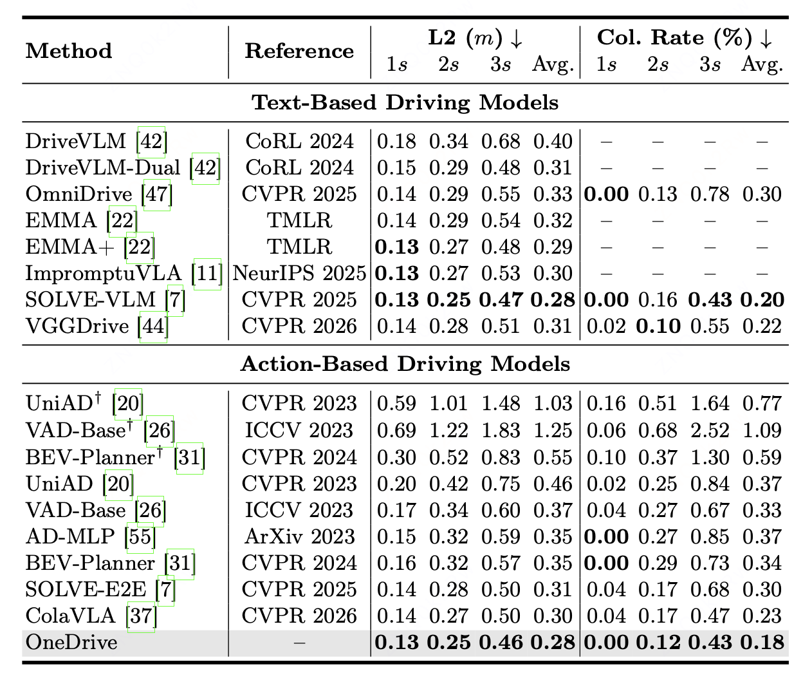

<br>
<p align="center">
  <h1 align="center"><strong>OneDrive: Unified Multi-Paradigm Driving with Vision-Language-Action Models</strong></h1>
</p>

<div id="top" align="center">

[](https://arxiv.org/abs/2604.17915)
[](https://arxiv.org/pdf/2604.17915)
</div>

## 🔥 News
- **[2026-04]** OneDrive [Paper](https://arxiv.org/abs/2604.17915) and Code are realeased!
---

## Updates
- [x] Release paper
- [x] Release code and training scripts on nuScenes.
- [ ] Release model weights on HuggingFace
- [ ] Release code and training scripts on NAVSIM.


## Architecture
<div align="center">
  
</div>

## Results
### Results on nuScenes.
<div align="center">
  
</div>

## Getting Started

1. [**Environment Setup**](./docs/setup.md)
2. [**Train&Inference**](./docs/train_infer.md)

## Acknowledgement
OneDrive is built upon the following outstanding open-source works:
- [OmniDrive](https://github.com/NVlabs/OmniDrive)
- [Solve](https://github.com/pqh22/ColaVLA)
- [InternVL3](https://github.com/opengvlab/internvl)


## Citation

If you find OneDrive useful in your research or applications, please consider giving us a star 🌟.
 <!-- and citing it by the following BibTeX entry: -->
<!-- 
```bibtex
@article{OneDrive,
  title={OneDrive: Unified Multi-Paradigm Driving with Vision-Language-Action Models},
  author={Zhang, Yiwei and Chen, Xuesong and Gao, Jin and Wang, Hanshi and Ge, Fudong and Hu, Weiming and Shi, Shaoshuai and Zhang, Zhipeng},
  journal={arXiv preprint arXiv:2604.02190},
  year={2026}
} 
``` -->